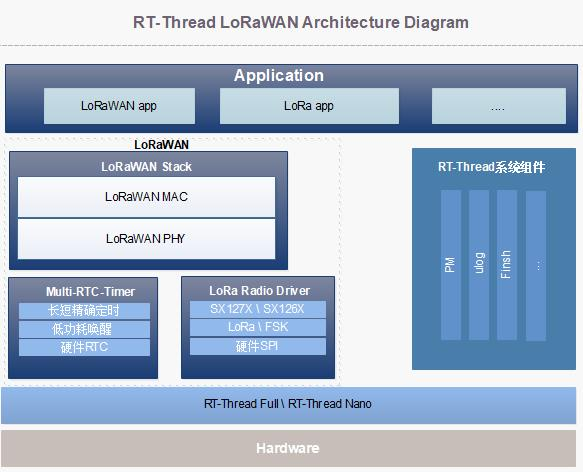

## 【JOB201910】 让 RT-Thread 支持 LoRaWAN

## 1、介绍

LoRa 作为低功耗局域网通信技术越来越流行，如果通过 LoRa 接入互联网，市面上还有挺多支持 LoRaWAN 的网关及节点设备。本活动希望节点侧的 LoRa 设备，能够使用 RT-Thread 操作系统，接入 LoRaWAN 网关，最终接入云平台。

节点侧的功能框图大致如下(by X-Jing@hangzhou)：

硬件平台：`RT-Thread 板卡` + ` SX12xx 模组` ，MCU 与模组之间通过 SPI 通信

项目将输出三个软件包，分别为：

### 1.1 LoRa Radio Driver

其代码将从 `LoRaMac-node` 提取，将 radio 的操作 API 集成在一个软件包内。

该软件包期望也能支持 nano ，甚至裸机。并在其中集成一些常用的射频测试函数，方便进行调试测试。

上层 LoRaWAN 软件包将依赖此软件包，实现底层通信解耦。

### 1.2 LoRa Multi-RTC Timer

multi-rtc-timer 是个比较轻薄的接口封装层。

对上，提供了统一定时器 API 给 LoRaWAN Stack；对下，将硬件定时器相关的 HAL 接口做了封装。

### 1.3 LoRaWAN Stack

这里主要是移植官方的 [协议栈]( https://github.com/Lora-net/LoRaMac-node ) ，通过上述两个软件包，协议栈可以实现对于硬件的解耦。

## 路线图 

项目大致分为以下几个阶段：

- M0: LoRa Radio Driver/LoRa Multi-RTC Timer 软件包开发阶段
- M1: LoRaWAN 节点协议栈移植适配阶段
- M2: LoRaWAN 协议栈测试，并接入云端
- M3: LoRaWAN 网关预研、正式研发阶段

### [立即申请]( https://github.com/RT-Thread/community-activities/edit/master/2019/JOB201910.md )

## 小组成员

### 张三

具体工作内容及时间安排

